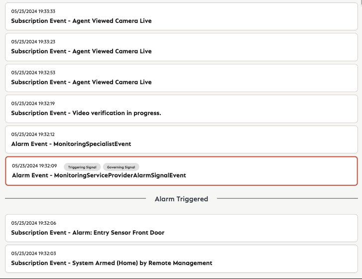
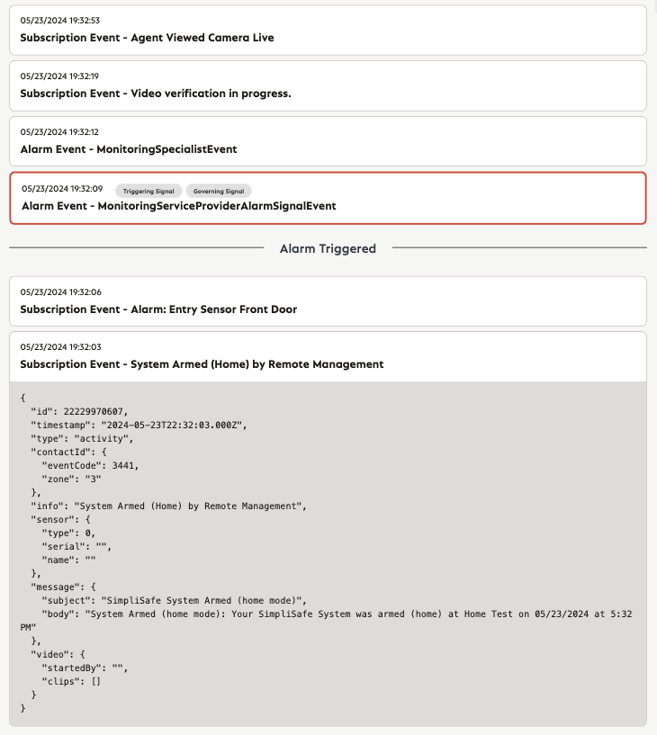

# Welcome to ViewAlarm!

Thank you for interviewing with the Monitoring Team at SimpliSafe. This interview project is inspired by the work we do every day monitoring alarms for our customers.

## Objective

Your goal is to implement an application that displays a timeline of events that occured during an alarm.

You already have the base implementation to retrieve the mock data from the `public/data/alarm.json` file and parse it as a list of events. Use this parsed data to build the rest of the application.

The visual designs you have for reference are mentioned below in the **Reference material** section, use your best judgement about the specific implementation details.

### Tasks

- Display the events on individual cards.
    - For each card include date (based on the event's `timestamp`), event source (Alarm or Subscription) and event `type`.
  - For Triggering Signals and Governing Signals add a pill UI element.
  - Order the events from most to least recent.
  - Add a red border for the triggering signal.
  - Add a separator between the triggering signal and the events prior to it.
  - When the user clicks on the event card, it should expand to show the raw JSON. Clicking an expanded card should collapse it again.

### Reference material

- Mock data: `public/data/alarm.json`
- Design:
  - Alarm Events \
  
  - Expanded Event \
  
  
## Running the application

In the project directory, you can run `npm start`, which runs the app in the development mode.

Open [http://localhost:3000](http://localhost:3000) to view it in the browser.

The page will reload if you make edits. You will also see any lint errors in the console.
